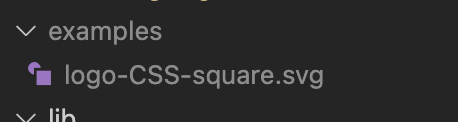

# Challenge 10 - SVG Logo Maker

## Project Description

Create a simple logo in SVG format in a matter of seconds! This easy-to-use command line utility will do the work for you, you don't need vector graphics software or knowledge of SVG/XML syntax to create a logo for your brand.

I applied OOP concepts to build this app such as class, inheritance, and polymorphism. Tests were written for all the classes I wrote for this project which helped me debug my code more efficiently; all tests passed!

Having worked with SVG files in the past, I was really excited to apply my knowledge of the file format. Using tests to validate my work was extremely helpful and new to me; I would rely on writing to the console to test and debug my code which I recognize is not efficient.

I would like to expand the functionality of this app in the future to allow the user to select a custom shape and enter the X and Y coordinates of at least 3 vertices.

## Table of Contents
- [User Story](#user-story)
- [Acceptance Criteria](#acceptance-criteria)
- [Links](#links)
- [Dependencies](#dependencies)
- [Tests](#tests)
- [Usage](#usage)
- [Walkthrough](#walkthrough)
- [Screenshots](#screenshots)

## User Story

```
AS a freelance web developer
I WANT to generate a simple logo for my projects
SO THAT I don't have to pay a graphic designer
```

## Acceptance Criteria

```
GIVEN a command-line application that accepts user input
WHEN I am prompted for text
THEN I can enter up to three characters
WHEN I am prompted for the text color
THEN I can enter a color keyword (OR a hexadecimal number)
WHEN I am prompted for a shape
THEN I am presented with a list of shapes to choose from: circle, triangle, and square
WHEN I am prompted for the shape's color
THEN I can enter a color keyword (OR a hexadecimal number)
WHEN I have entered input for all the prompts
THEN an SVG file is created named `logo.svg`
AND the output text "Generated logo.svg" is printed in the command line
WHEN I open the `logo.svg` file in a browser
THEN I am shown a 300x200 pixel image that matches the criteria I entered
```
 
## Links

To access the code repository, use the link below:

- ### GitHub Repository URL
    https://github.com/sergiorodriguezdev/chl-10-svg-logo-maker 

## Dependencies

To install the appropriate dependencies, execute the following command from the repo folder:

```
npm install
```

Alternatively, if the `package.json` file is missing, execute the following commands from the repo folder:

```
npm init -y
npm install --save-dev jest@24.9.0
npm install inquirer@8.2.4
```

## Tests

To run tests, you must first install the dependencies as specified in the [Dependencies](#dependencies) section. Then, execute the following command from the repo folder:

```
npm test
```

## Usage

Clone or download the repo folder to your local machine and install the dependencies as specified in the [Dependencies](#dependencies) section. Then, launch the app using the following command:

```
node index.js
```

You will be asked to provide parameters for your logo design, and a logo in SVG format will be created for you that will match the parameters you entered. To avoid overwriting existing logos, each SVG file will be saved to the `./examples` sub directory and the file name will include the text and shape values you entered. For example, if you entered `LIT` as the text and selected the `Triangle` shape, the path to the logo will be `./examples/logo-LIT-triangle.svg`.

You have the option to select a predefined color from a list or enter the 6 character Hex value of the color of your choice. Please use [this article](https://developer.mozilla.org/en-US/docs/Web/CSS/named-color) as reference for valid color Hex entries.

## Walkthrough

Click [HERE](https://user-images.githubusercontent.com/119548442/235263556-82fe9289-445d-45ab-87ea-2f4b96aef48c.mp4) for a walkthrough of the app.

## Screenshots

### Usage


### SVG Logo


### SVG Contents


### SVG Preview

